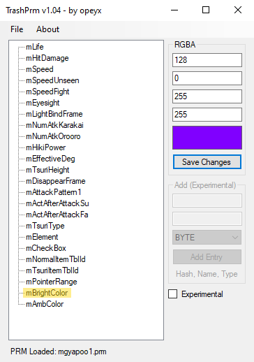
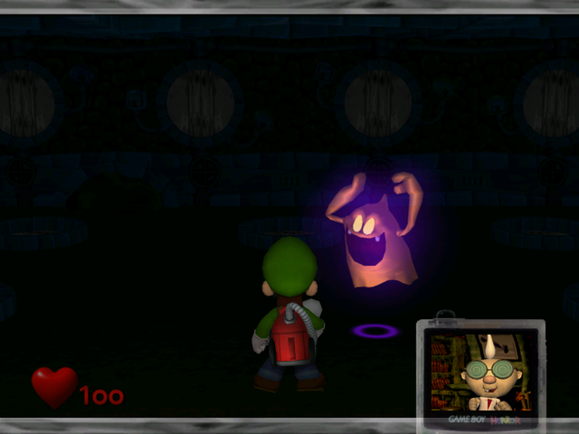

#Changing Ghost Color

To change a ghost's color you must modify both the PRM, and the textures of the model.

##Editing PRM

To get started, open up your root and head to the Game folder. Extract game_usa.szp for NTSC, and game_e for PAL. Once inside the data folder, go to param → ctp.
This folder contains all of the ghost parameter files, here we can change the "glow" color. For this tutorial I'll be editing mgyapoo.prm, which is the training room gold ghost.

Load the prm file in TrashPRM, and click on mBrightColor. From here, edit the RGBA values any way you like, and click "Save Changes".
If the the color preview does not immediatley update, click on another parameter setting, then back on mBrightColor. This will "refresh" the preview.
Once you're done, go to File → Save.

{ height='400" }

After you've modified the PRM file, pack the "data" folder to SZP. Make sure to rename it back to game_usa.szp or game_e.szp. Rebuild your ISO, and you should have something that looks like this.

{ height='400" }

To change the ghost model color itself, you'll need to edit some textures.

##Editing Ghost Textures

To edit textures you'll need to use LMTextureInjector, which is a commandline tool.

First, head over to the "model" folder. Find and unpack the SZP of the model you're trying to edit, for the gold ghost it's obake01.szp.
Open the SZP's folder and go into the sub "model" folder. Copy the .mdl model file and paste it inside the LMTextureInjector tool folder. You can then drag and drop the .mdl onto LMTextureInjector.exe,
which will give you a folder with all the ghost's textures. Edit these in the editing software of your choice.

Next, you'll need to use LMTextureInjector via commandline. Open up Command Prompt and get to the LMTextureInjector tool directory. To inject your edited textures back into the MDL, run the following:

```LMTextureInjector.exe modelname.mdl foldername```

A new MDL model will be genrated with the extension ".new.mdl". Put this new MDL file into the SZP model sub folder, replacing the original. Pack the folder into SZP, then rebuild.

{ height='400" }

With both the PRM and texture changed, the ghost's new color will look complete!

!!! warning "Warning"
		Some ghost models use multiple or duplicate body textures. If your texture edit doesn't appear, make sure you've edited the correct texture.

###[Next :material-arrow-right-bold-box:](02_Recommended_Tools.md) { align=center }